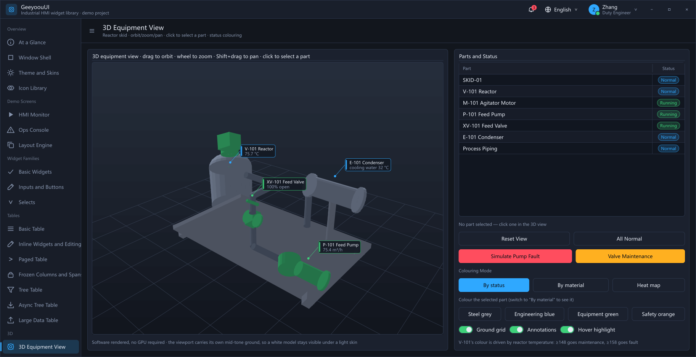
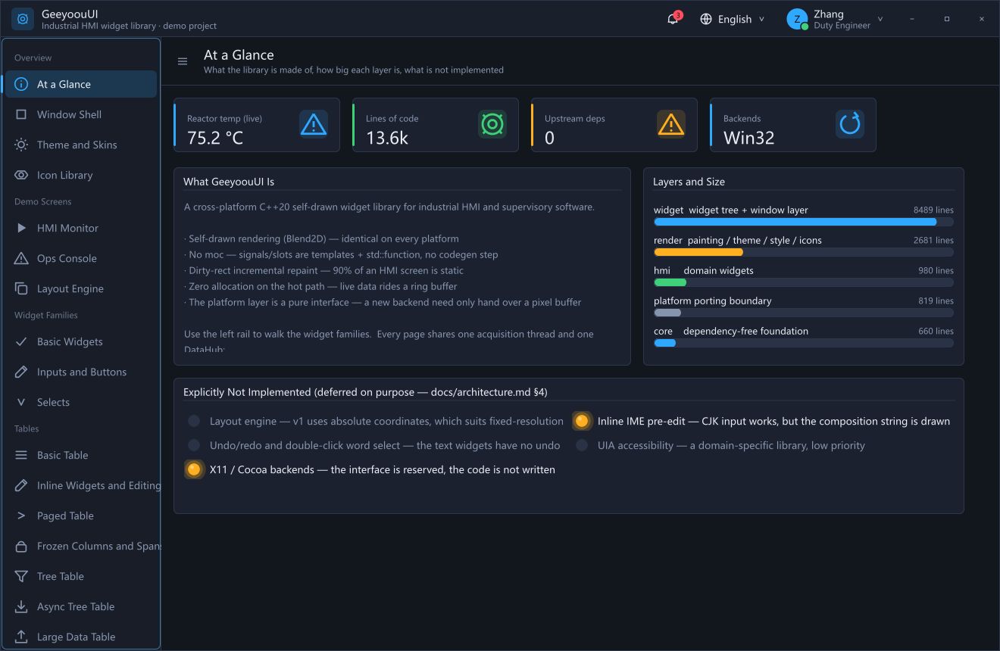
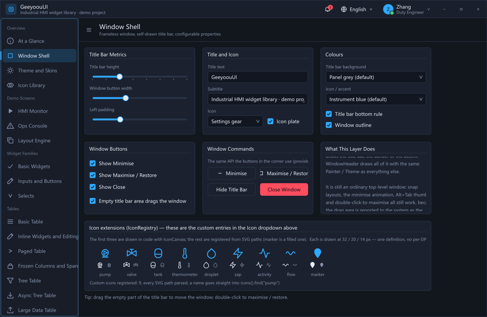
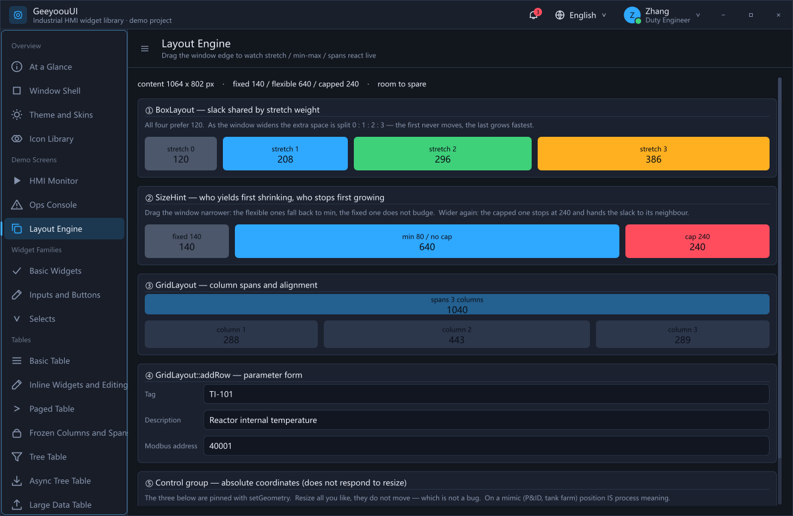
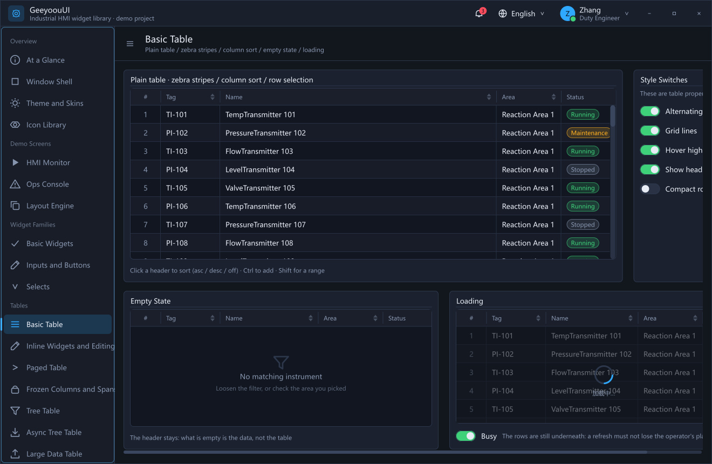
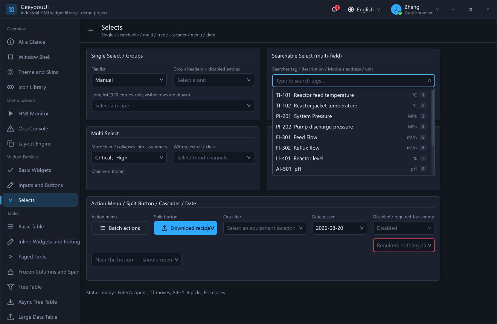

<p align="center">
  <b>English</b>
  &nbsp;·&nbsp;
  <a href="README.zh-CN.md">简体中文</a>
</p>

<h1 align="center">GeeyoouUI</h1>

<p align="center">
  <b>An MIT-licensed C++20 GUI toolkit for industrial HMI &amp; operator consoles.</b><br>
  No moc. No code generation. No LGPL compliance paperwork. No Qt.
</p>

<p align="center">
  
  
  
  
  
</p>

<p align="center">
  <i>⭐ If a permissively-licensed alternative to Qt Widgets is something you want to exist, a star is the cheapest way to say so.</i>
</p>

<p align="center">
  
</p>

<p align="center">
  <i>Every pixel above is drawn by this library — the title bar, the 3D viewport, the table, the switches.<br>
  No GPU, no Qt, no resource files. This is <code>build\bin\showcase.exe</code>.</i>
</p>

---

## Why this exists

Building an industrial HMI or a machine-side operator console in C++ usually means Qt. Qt is
excellent — and it also means one of these:

- ship under **GPL/LGPL** and take on the relinking obligation for your customers' cabinets, or
- pay for a **commercial license**, per developer, forever, or
- fight `windeployqt`, plugin folders, and a DLL set larger than your own application.

GeeyoouUI is the other trade. Everything it draws, it draws itself, so there is nothing to
comply with and nothing to deploy beyond your own executable.

| | GeeyoouUI | Qt Widgets |
|---|---|---|
| **License** | ✅ MIT — static-link into closed-source products, no obligations | GPL v3 / LGPL v3 / paid commercial |
| **Dependency licenses** | ✅ Blend2D + AsmJit, both Zlib — fully permissive stack | Qt + its third-party set |
| **Code generation** | ✅ None. Signals/slots are templates + `std::function` | `moc` pre-build step |
| **Build setup** | ✅ Visual Studio only; deps auto-fetched by CMake, pinned commits | Install the Qt SDK, match compiler/ABI |
| **Deployment** | ✅ Your `.exe` — no plugin dirs, no `windeployqt` | Qt DLLs, platform plugins, imageformats… |
| **Look & feel** | ✅ Self-drawn — pixel-identical on every machine, ignores Windows theme | Follows platform style |
| **Repaint model** | ✅ Dirty-rect incremental (HMI screens are ~90% static pixels) | Full-widget repaints |
| **Hot path allocations** | ✅ Zero — live data goes through fixed-capacity ring buffers | General purpose |
| **Skinning** | ✅ Skin registry + one accent color drives the palette + QSS-like selectors, hot-swap at runtime | QSS, per-widget |
| **Layout** | ✅ `BoxLayout` / `GridLayout` with stretch, min/max and column spans — **or** absolute coordinates, which is how mimic screens are authored | Full layout system |
| **Platforms** | ❌ **Windows only today.** Platform layer is 12 pure virtuals; X11/Cocoa unimplemented | Windows, macOS, Linux, mobile, embedded |
| **Accessibility** | ❌ Not implemented (no UIA) | Mature |
| **Ecosystem** | ❌ 30+ widgets, one library | Enormous |

**Read that table honestly.** If you need Linux today or screen-reader support, use Qt —
GeeyoouUI will waste your time. If you ship a Windows operator station and the license is the
thing standing in your way, this is built exactly for you.

## Quick start

You need **Visual Studio with the C++ workload**. CMake, Ninja and MSVC are all taken from
VS itself — **nothing has to be on your `PATH`**:

```
build.bat
```

The first build fetches Blend2D and AsmJit via CMake `FetchContent` (pinned commits,
reproducible), about 2 minutes. If VS lives somewhere unusual, edit `VSROOT` in `build.bat`.

Then run the showcase:

```
build\bin\showcase.exe
```

## Hello, world

```cpp
#include "geeyoou/hmi/Gauge.hpp"
#include "geeyoou/platform/Platform.hpp"
#include "geeyoou/widget/AppWindow.hpp"

using namespace geeyoou;

int main() {
  AppWindow win("Temperature", 400, 340);       // frameless window + self-drawn title bar
  win.header()->setIcon(Icon::Info);

  auto* g = win.content()->add<Gauge>();
  g->setGeometry({20, 20, 360, 260});
  g->setRange(0, 200);
  g->setBands(150, 180);                        // warning / alarm thresholds
  g->setTitle("Reactor core");
  g->setUnit("°C");
  g->setValue(87.5);

  g->valueChanged.connect([](double v) { /* no macros, no moc */ });

  win.show();
  return platform().runEventLoop();
}
```

That is the whole program. No `.pro` file, no `Q_OBJECT`, no build step between you and the
compiler.

## Feature tour

- **Self-drawn rendering** — Blend2D (CPU JIT rasterizer), 100% identical appearance everywhere
- **Self-drawn windows** — frameless window + custom title bar that ignores the Windows theme,
  while snap layouts, double-click-to-maximize and Alt+Tab all keep working
- **Swappable skins** — skin registry + one accent color driving the whole palette + QSS-like
  selectors, hot-swapped at runtime, no recompile
- **No moc** — signals and slots are templates + `std::function`, zero code generation
- **Dirty-rect incremental repaint** — 90% of an HMI screen is static; don't redraw the frame
- **Zero allocation on hot paths** — live data flows through fixed-capacity ring buffers,
  suited to unattended long-running operation
- **Layout when you want it** — `BoxLayout` / `GridLayout` with stretch and min/max, or plain
  absolute coordinates when the screen is a mimic and position carries process meaning
- **Platform layer is a pure interface** — v1 implements Win32; X11 / Cocoa need 12 methods

## The showcase app

**One entry point:** `build\bin\showcase.exe` (`examples/showcase`).

An admin-console shell: navigation on the left, the matching widget family in the content area.
The whole window is a `ShowcaseWindow : AppWindow` — no Windows title bar; icon + title +
subtitle top-left, notifications / language switch / account dropdown top-right, then
self-drawn minimize, maximize and close.

<p align="center">
  
</p>

**18 pages**, grouped by what they demonstrate:

| Page | Content | What it also proves |
|---|---|---|
| At a Glance | Library composition, layer sizes, the not-implemented list | Multi-line `Label`, live stat cards |
| Window Shell | Title bar height / colours / icon / button visibility, edited live | Frameless window, `HitZone` drag regions, window commands |
| Theme and Skins | Switch skin / accent colour / edit the stylesheet in place | Skin registry, `@token`, selectors and cascade |
| Icon Library | All built-in and custom icons, searchable | `IconRegistry`, size comparison, usage snippets |
| HMI Monitor | Gauges / status LEDs / live trends | The whole render pipeline + CJK text |
| Ops Console | Alarm list / scrolling form / acquisition queue | Pull-model `ListView`, nested `ScrollArea`, cross-thread queue |
| Layout Engine | Stretch weights, min/max clamping, column spans — resize and watch | `BoxLayout` / `GridLayout` reacting live |
| Basic Widgets | Buttons / switches / radios / sliders / spin boxes | Focus traversal, group-wide disable interlock |
| Inputs and Buttons | Text input family, button variants, icon buttons | IME test bench (switch to a CJK IME; the candidate window should track the caret) |
| Selects | Single / searchable / multi / tree / cascader / menu / date | Popups escaping **both** `GroupBox` and `ScrollArea` clipping |
| **Tables** ×7 | Basic, inline editing, paged, frozen + spans, tree, async tree, 200 000 rows | One `TableView`, seven properties — virtualisation, frozen geometry, async child load |
| 3D Equipment View | Reactor skid, orbit/zoom/pan, click-to-pick, status colouring | `View3D` software rendering, no GPU anywhere |

Every page **shares one acquisition thread and one `DataHub`** — "HMI Monitor" and
"Ops Console" observe the same live data, which is itself the demonstration of the rule
that *the acquisition thread never touches a Widget*.

**The language switch in the title bar is real.** Picking a language re-labels the header and
rebuilds every page from the translation tables in `examples/showcase/i18n/` — one file per
language. The screenshots in this file and in [the Chinese README](README.zh-CN.md) are the
same binary, taken in the two languages.

Pages are built on demand: a page you never opened costs nothing beyond its nav entry, and a
hidden page stops its periodic work automatically because `animationTickTree` skips invisible
subtrees.

## Window layer

Application windows derive from `AppWindow` (`widget/AppWindow.hpp`), which is **frameless by
default**: Windows no longer paints the title bar, border or accent color — `WindowHeader`
paints it with the same `Painter` / `Theme` as everything else.

<p align="center">
  
</p>

<p align="center">
  <i>The "Window Shell" page drives the real title bar above it. Every slider and dropdown here
  is a <code>WindowHeader</code> setter — the chrome is ordinary widget code.</i>
</p>

```cpp
class PlantWindow : public AppWindow {
 public:
  PlantWindow() : AppWindow("Batching line", 1280, 800) {
    header()->setHeight(48);
    header()->setIcon(Icon::Settings);
    header()->setTitle("Batching line");
    header()->setSubtitle("Reactor #2 · online");

    auto* lang = header()->addTrailingItem<HeaderMenu>(0);
    lang->setIcon(Icon::Globe);
    lang->setText("English");
    lang->setItems({{"简体中文", "zh-CN"}, {"English", "en-US"}});
    header()->setTrailingItemWidth(lang, lang->preferredWidth());

    auto* me = header()->addTrailingItem<HeaderAvatar>(0);
    me->setInitials("JD");
    me->setName("Jane Doe");
    me->setCaption("Duty engineer");
    me->setItems({{"Profile", "profile"}, MenuItem::sep(), {"Sign out", "logout"}});
    header()->setTrailingItemWidth(me, me->preferredWidth());

    setContent<PlantScreen>();   // automatically tracks the content area
  }
};
```

**The entire title bar drags the window** — except the three window buttons and anything you
added with `addTrailingItem()` (those take their own clicks). The drag region is reported to
the OS *as the window caption*, so snap layouts, double-click-to-maximize, the right-click
system menu and border resizing all keep working. You write no drag logic at all.

| `WindowHeader` property | Purpose |
|---|---|
| `setHeight` / `setLeadingPadding` / `setTrailingPadding` | Title bar metrics |
| `setBackground` / `setBorderColor` / `setBorderVisible` | Fill and bottom separator |
| `setTitle` / `setSubtitle` / `setTitleColor` / `setTitleFontSize` | Title and subtitle |
| `setIcon` / `setIconColor` / `setIconSize` / `setIconBadge` | Leading icon, optional rounded plate |
| `setButtons` / `setButtonWidth` / `setButtonColor` / `setCloseHoverColor` | Minimize / maximize / close |
| `setDraggable` | Whether empty space drags the window |
| `addTrailingItem<T>()` / `setTrailingItemWidth()` / `addTrailingGap()` | Insert any widget on the right, right-aligned as a group |

| Window-layer widget | Purpose |
|---|---|
| `AppWindow` | Window base: frameless + `header()` + `content()` + `setContent<T>()` |
| `WindowHeader` | Self-drawn title bar; it paints the window buttons itself, flush to the corner (Fitts's law) |
| `HeaderMenu` | Title-bar dropdown: icon + text + chevron, optional numeric badge (notification bell) |
| `HeaderAvatar` | Account block: round avatar (initials) + name + role + presence dot + menu |

`Window` also exposes `minimize()` / `maximize()` / `restore()` / `toggleMaximize()` /
`isMaximized()` / `close()` — the self-drawn buttons and your business code use the same API.

Need the native OS frame? Pass `WindowOptions{.frameless = false}` to the `AppWindow`
constructor.

## Layout — or deliberately without one

A widget hands its content rectangle to at most one `Layout`, which places that widget's
**direct children** and nothing else:

```cpp
auto* row = panel->setLayout<BoxLayout>(Orientation::Horizontal);
row->setSpacing(12);
row->addWidget(fixed,    /*stretch*/ 0);   // never moves
row->addWidget(elastic,  /*stretch*/ 1);   // takes the slack
row->addWidget(capped,   /*stretch*/ 2);   // takes twice as much, up to its max

auto* form = box->setLayout<GridLayout>();
form->addRow(tagLabel,  tagEdit);          // label column + field column
form->addRow(descLabel, descEdit);
form->setColumnStretch(1, 1);              // the fields take the width
```

Size hints carry `min` / `preferred` / `max`, so shrinking falls back to `min` in stretch
order and growing stops at `max` — the page below is the demonstration, and it reflows while
you drag the window edge.

<p align="center">
  
</p>

**Absolute coordinates remain first-class.** `setGeometry()` is not a legacy path: on a mimic
screen a pump drawn 40 px left of a valve is *process semantics*, not typography, and a layout
engine that reflows it has destroyed information. Both styles are supported, both are used by
the showcase, and `docs/iterations/02-layout-engine.md` records why.

## Theme / Skin / StyleSheet

Three layers of capability. Reach up only when you must — **if the lower layer can express it,
use the lower layer.**

### 1. Theme — a token struct

21 colors + radii + font sizes. Every color in the library is read from `Theme::current()`
**at paint time**, so switching a theme needs no per-widget notification:

```cpp
Theme::current() = lightTheme();   // all 32 widget types follow
```

### 2. Skin — registry + hot swap

A skin = a `Theme` + a stylesheet, registered by name, switchable at runtime:

```cpp
#include "geeyoou/render/Skin.hpp"

skins().apply("light");                            // built in: dark / light / contrast / amber
skins().setAccent(Color::rgb(0x12, 0xC2, 0xC2));   // one color drives the whole palette

// register your own
Skin s;
s.name  = "acme";
s.title = "ACME house style";
s.theme = themeWithAccent(darkTheme(), Color::rgb(0xE8, 0x6C, 0x00));
s.styleSheet = "PushButton { border-radius: 2; }";
skins().add(s);
skins().apply("acme");
```

`setAccent()` only moves tokens **derived from the brand color** (accent / primary / focusRing /
selection fill, plus the label color on filled buttons — black or white chosen by luminance).
`ok` / `warn` / `alarm` are **left alone**: an alarm must always look like an alarm.

`Window` subscribes to `skins().changed` and repaints itself; your code does nothing.

### 3. StyleSheet — QSS-like selectors

For what tokens cannot express: *"this one E-stop button needs square corners and its own red."*

```qss
/* C-style comments */
* { font-size: 13; }                        /* any widget            */
PushButton { border-radius: 8; }            /* by type, subclasses too */
PushButton:hover { border-color: @accent; } /* by state              */
.danger { accent: #FF4D5E; }                /* by style class        */
#emergencyStop { border-width: 2; }         /* by objectName         */
GroupBox PushButton { font-size: 12; }      /* descendant            */
Label, Separator { color: @textDim; }       /* grouped               */
```

```cpp
btn->setObjectName("emergencyStop");
btn->addStyleClass("danger");
skins().reloadStyleSheet(qssText);     // parse errors never throw — see below
```

| | |
|---|---|
| States | `:hover` `:pressed` `:checked` `:focus` `:disabled` `:read-only` `:invalid` `:open` `:selected` |
| Properties | `color` `background` `border-color` `border-width` `border-radius` `font-size` `accent` `icon-color` `padding` |
| Colors | `#RGB` `#RRGGBB` `#AARRGGBB` `rgb()` `rgba()` `transparent`, plus **`@accent` `@panel` `@text` …** |

**`@token` references the current theme** and is evaluated at parse time: one stylesheet holds
up under all four skins — you don't write a hex variant per skin.

Points worth knowing:

- **Specificity follows CSS** (id > class+state > type), ties broken by source order, decided
  **per property** — two rules can each contribute part of the result
- **States are subset matches**: `:hover` still applies to a widget that is both hovered and focused
- **Type selectors match subclasses**: `PushButton { }` also hits `IconButton` / `MenuButton` /
  `HeaderMenu` (no RTTI — a virtual chain woven in by the `GEEYOOU_STYLE_TYPE` macro)
- **Priority: code > stylesheet > theme.** The opposite of Qt — a `setColor()` on one instance is
  more specific than a selector written for a whole widget class
- **Parse errors never throw**: a stylesheet is content, not code. One bad line drops that rule
  only; everything else still applies, and the errors land in `StyleSheet::errors()` for display

**Widgets wired to selectors**: the `PushButton` family, `Label`, `GroupBox`, the `LineEdit`
family, `CheckBox`, `RadioButton`, `ToggleSwitch`, `Slider`, `ProgressBar`, `Separator`,
`WindowHeader`. The rest follow `Theme` only — a deliberate trade, reasoning in
`docs/architecture.md` §2.6.

## Widget catalog

<p align="center">
  
</p>

<p align="center">
  <i><code>TableView</code> paints every cell itself — ordinals, chips, switches, progress bars,
  action links. The empty and loading states keep the header, because what is empty is the
  data, not the table.</i>
</p>

| General (`widget/`) | Purpose |
|---|---|
| `Label` | Text with horizontal/vertical alignment; follows theme and stylesheet unless you `setColor()` |
| `PushButton` | Plain / latching (`setCheckable`) |
| `CheckBox` | Boolean parameter |
| `RadioButton` | Auto-exclusive by parent + group id |
| `ToggleSwitch` | Equipment start/stop (no animation — state must be unambiguous instantly) |
| `Slider` | Drag / click-to-jump / arrows / PgUp·PgDn / Home·End, optional ticks |
| `ProgressBar` | Read-only fill indicator, custom text |
| `GroupBox` | Titled container; disabling it disables the whole subtree |
| `Separator` | Horizontal / vertical rule |
| `SpinBox` | Numeric entry: ↑↓ step, PgUp/PgDn ×10, direct typing, Enter commits / Esc reverts |
| `LineEdit` | Single line: caret, selection, drag-select, clipboard, horizontal scroll, placeholder, max length (in characters), clear button, leading icon, invalid state, read-only |
| `PasswordEdit` | Password field with optional reveal eye; refuses Ctrl+C/X while masked |
| `SearchBox` | Search icon + clear button; `textChanged` for live filtering / `searchRequested` on Enter |
| `TextArea` | Multi-line: soft wrap, cross-line caret and selection, wheel and scrollbar, read-only |
| `IconButton` | Icon-only button, optionally circular |
| `ComboBox` | Single-select dropdown with group headers, disabled items, Alt+1..9 |
| `SearchableSelect` | Search-as-you-type dropdown: **multi-field search** across `text`/`secondary`/`extraFields`, match highlighting, no-result callback |
| `MultiSelect` | Multi-select dropdown: check rows, select-all/clear, closed-state summary (collapses to "N selected" past a threshold) |
| `TreeSelect` | Tree dropdown: expand/collapse, optional leaf-only selection, full-path display |
| `PopupList` | Shared candidate list (used by the whole dropdown family; renders visible rows only — tens of thousands of items are fine) |
| `Cascader` | Cascading selection: linked columns (shop → line → device), full-path display |
| `MenuButton` / `SplitButton` | Action menu (icons / shortcut hints / separators / disabled items); split button |
| `DatePicker` / `CalendarView` | Date selection: Monday-first, weekend coloring, range limits, month paging |
| `ScrollArea` | Scrolling container: wheel, thumb drag, page-on-track-click, `ensureVisible` |
| `ListView` | Virtualized multi-column table with a **pull model** (cells fetched by callback — a million rows costs no memory) |
| `TableView` | Data grid: **every cell is painted** (ordinal, checkbox, switch, progress, chip, action links, tree expander), with four resident editors re-used for in-cell editing; frozen panes, merged cells, three-state column sort, zebra rows, loading and empty states |
| `TableModel` / `TreeTableModel` | The table's pull data source (**not a widget, never in the widget tree**); the tree model owns expansion state and the three-state **async child load** (Loading / Ready / Failed), emitting `childrenRequested` rather than fetching |
| `TablePager` | Page strip: total, page size, numbered pages with ellipses. **Holds no pointer to a table** -- it emits a page number and nothing else |
| `scene3d/View3D` | **3D viewport**, software rendered -- no GPU anywhere. Left-drag orbits, wheel zooms, Shift+left-drag pans, a click picks a part. Picking walks the same projected faces the frame drew, so **you pick what you can see**. The viewport carries **its own mid-tone backdrop**, so a white model stays visible under a light skin; three colour modes (status / material / value heat map) |
| `scene3d/Scene3D` | The world, its part table and its **annotations** (**not a widget, never in the widget tree**). `setPartState` colours by condition, `setPartMaterial` paints, `setPartValue` feeds the heat map, `addAnnotation` pins a leader-line label that follows its part; state is stored as MEANING and resolved against the live theme at paint time |
| `scene3d/MeshBuilder` | Seven **convex closed** primitives: box, cylinder, cone, sphere, dome, pipe, flange. `Mesh` is a **non-owning window**, so an external model loader lives outside the library and feeds the same type |

| Data layer | Purpose |
|---|---|
| `core/DataQueue<T>` | Bounded thread-safe queue; on overflow drops the oldest and **counts it** — never grows unbounded |
| `hmi/DataHub` | Acquisition thread `push()` → UI thread `drain()`; channel management, last-value cache, drop statistics |
| `hmi/AlarmList` | Alarm list: severity colors, ack/clear states, fixed-capacity ring buffer, filtering and statistics |

| Domain (`hmi/`) | Purpose |
|---|---|
| `StatusLed` | Indicator: Off/Ok/Warn/Alarm, alarms can blink |
| `Gauge` | Arc gauge + numeric readout + warning/alarm bands |
| `TrendChart` | Multi-channel live curves on fixed-capacity ring buffers |

**Button variants**: `PushButton::setVariant()` takes `Default` / `Primary` / `Success` /
`Warning` / `Danger` / `Ghost`, plus `setIcon()`, `setLoading()` (spinner — call
`Window::enableAnimations()` first) and `setCheckable()` (latching).

<p align="center">
  
</p>

<p align="center">
  <i>The open dropdown is the load-bearing detail: it is parented to the <b>Window</b>, so it
  escapes both the <code>GroupBox</code> that owns the field and the <code>ScrollArea</code>
  the page sits in. Neither clip applies to it.</i>
</p>

## Icons: built in, collected, extended

`render/Icon.hpp` ships **38 built-in vector icons**, all drawn in code: no resource files, no
icon font, themeable, scale-free (one definition serves a 14px inline glyph and a 48px title bar).

But a built-in set can never cover **your domain** — a batching plant needs pumps, valves and
reactors, not generic UI glyphs. So `Icon` is not a closed enum, it is a **handle**:
`IconRegistry` hands out ids starting at `Icon::FirstCustom`, and registered icons are still
`Icon` values — so **all 19 existing APIs that take an `Icon` keep working unchanged**.

```cpp
#include "geeyoou/render/IconRegistry.hpp"

// Option 1: draw in code, on the same 24x24 grid as the built-ins.
icons().add("pump", [](Painter&, const IconCanvas& g) {
  g.circle(12, 11, 6.5f);
  g.poly({{9.5f, 7.5f}, {16.5f, 11}, {9.5f, 14.5f}, {9.5f, 7.5f}});
  g.line(5.5f, 20, 18.5f, 20);
}, "Equipment");

// Option 2: SVG path data — paste the `d` attribute straight from an icon set.
icons().addSvgPath("thermometer",
                   "M14 14.8V4a2 2 0 0 0-4 0v10.8a4 4 0 1 0 4 0z",
                   PathStyle::Stroke, 24.0f, "Instruments");

// Usage is indistinguishable from a built-in
header()->setIcon(icons().find("pump"));
btn->setIcon(icons().find("thermometer"));
```

**Why the SVG route pays off**: Lucide / Feather / Tabler / Material are all **24×24 grid with
2-unit strokes** — exactly this library's drawing grid, so their `d` attributes drop straight in.
Supported commands: `M m L l H h V v C c S s Q q T t A a Z z`, covering everything mainstream
icon sets actually emit.

**And it's faster**: an SVG path is parsed **once at registration** and stored; each paint is
just transform + stroke, whereas a hand-drawn icon rebuilds its geometry every paint. The same
cache can later be applied to the built-ins.

| API | Purpose |
|---|---|
| `icons().add(name, drawer, category)` | Register a code-drawn icon; a duplicate name **replaces the drawing but keeps the id** (widgets already holding the handle don't go blank) |
| `icons().addSvgPath(name, d, style, viewBox, category)` | Register an SVG path; `PathStyle::Stroke` / `Fill` must match the source or you get spaghetti or a blob |
| `icons().find(name)` | Look up by name, built-ins included (`find("warning")`); unknown returns `Icon::None` |
| `icons().name(id)` / `all()` / `categories()` | Reverse lookup and enumeration — what an icon picker page is built on |
| `icons().errors()` | SVG parse problems; **parsing never throws** — an icon is content, not code |

Built-in names are kebab-case (`chevron-down` / `window-minimize` / `eye-off`), matching the
mainstream sets, so a name copied from elsewhere usually resolves as-is.

**An unregistered id draws nothing** — not a placeholder box. On a plant screen, a stand-in that
looks like a real symbol is more dangerous than blank space.

See `examples/showcase/PlantIcons.cpp` (9 custom icons, both entry methods); the result is at the
bottom of the "Window shell" page.

## Text input & keyboard

**CJK input**: text fields support IME with the candidate window tracking the caret; the
in-progress composition is drawn by the system IME window (no inline pre-edit yet — see
`docs/architecture.md` §3.8).

Keyboard conventions: `Tab`/`Shift+Tab` moves focus (order = construction order), `Space`
activates, arrows adjust values. Text widgets support `Ctrl+A/C/X/V`, `Home`/`End`,
`Shift+arrow` to extend a selection, and `Esc` to revert.

## Source layout

```
include/geeyoou/
  core/       Types.hpp   geometry and color (logical pixels throughout)
              Signal.hpp  moc-free signals and slots
              Event.hpp   input events
  platform/   Platform.hpp   ← the porting boundary, pure virtual (incl. HitZone / WindowOptions)
  render/     Painter.hpp    Blend2D facade (the only place that touches BL*)
              Theme.hpp      token struct
              Skin.hpp       skin registry + accent derivation
              StyleSheet.hpp QSS-like selectors and cascade
              Icon.hpp       38 built-in vector icons
              IconRegistry.hpp  icon registry + IconCanvas drawing grid
              VectorPath.hpp    outline container + SVG path parser
  widget/     AppWindow / WindowHeader   window layer: frameless window and self-drawn chrome
              Widget / Window / Label / PushButton
  hmi/        Theme / StatusLed / Gauge / TrendChart
src/          mirrors include/, plus platform/win32/
docs/         architecture.md — design decisions and trade-offs; read before you touch anything
```

## Status & roadmap

**Working in v1**: the Win32 backend, Per-Monitor DPI v2, dirty rectangles, the widget tree, the
frameless window layer, CJK text rendering, the `BoxLayout` / `GridLayout` engine, the
`TableView` family (frozen panes, spans, async tree loading, 200 000-row virtualisation) and
the software-rendered `View3D`.

**Not implemented yet** — deliberately deferred, reasoning in `docs/architecture.md` §4:

| | Why it's deferred |
|---|---|
| Accessibility (UIA) | Needs the widget tree to stabilize first |
| Inline IME pre-edit | The system candidate window already tracks the caret; inline editing is polish |
| X11 / Cocoa backends | The platform layer is 12 pure virtuals — the port is scoped, not started |

See `docs/roadmap.md` for what comes next.

## Contributing

Issues and PRs are welcome — especially:

- **X11 or Cocoa backend** — implement `platform/Platform.hpp` (12 methods) and the toolkit follows
- **Domain icon packs** — pumps, valves, breakers, conveyors; `addSvgPath` makes this cheap
- **Skins** — a skin is a `Theme` + a stylesheet; ship yours as a single file
- **Bug reports from real plant floors** — the ones that matter most

Read `docs/architecture.md` first: it records which trade-offs were made on purpose, which
saves you from "fixing" one.

## License

[MIT](LICENSE) — use it in commercial, closed-source products, statically linked, without
obligation. The dependencies (Blend2D, AsmJit) are Zlib-licensed, so the whole stack stays
permissive.

---

<p align="center">
  If GeeyoouUI saves you a Qt license or an afternoon of <code>windeployqt</code>,<br>
  <b>⭐ star the repo</b> — it's what tells us to keep building it.
</p>
