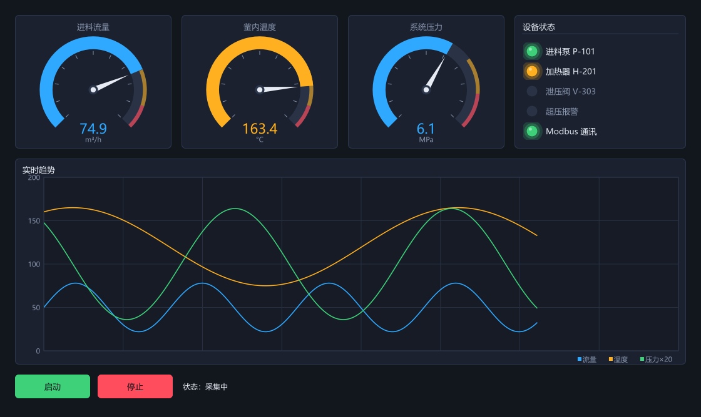
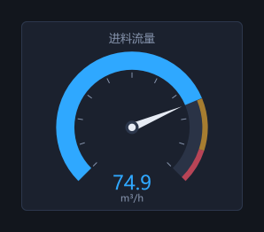
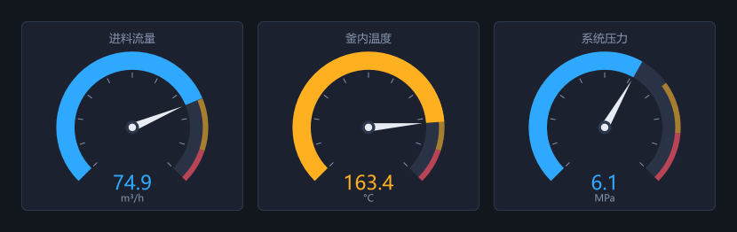
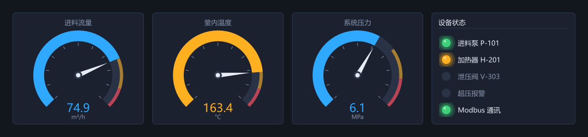
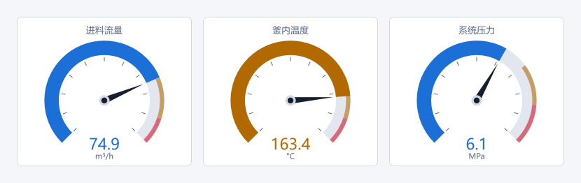

<p align="center">
  <b>简体中文</b>
  &nbsp;|&nbsp;
  <a href="../../README.zh-CN.md">← 回到项目首页</a>
</p>

# 30 分钟做一个反应釜监控画面

用 [GeeyoouUI](https://github.com/sj7suren/GeeyoouUI) 从零写一个真正像样的工控上位机画面：三个仪表、一排设备状态灯、一条多通道实时趋势曲线，数据来自后台采集线程。

**做完你会得到这个** —— 而且它是能跑的，不是效果图：

<p align="center">
  
</p>

> **这张图和本文所有配图都是代码画出来的。**
> 它们由 `examples/tutorial/shots.cpp` 离屏渲染生成，走的是和真实窗口完全相同的绘制路径。所以图不可能和代码对不上 —— 教程配图最常见的腐烂方式，就是代码改了而截图没跟着改。

全部代码 100 行出头。没有 `.ui` 文件，没有 `moc`，没有代码生成步骤，没有 Qt 授权。

**读者定位**：会 C++、要做工控 HMI / 上位机的人。不需要任何 GUI 框架经验。

---

## 目录

1. [环境准备（3 分钟）](#1-环境准备3-分钟)
2. [第一个窗口](#2-第一个窗口)
3. [第一个仪表](#3-第一个仪表)
4. [三个仪表：把参数抽成表](#4-三个仪表把参数抽成表)
5. [设备状态灯](#5-设备状态灯)
6. [实时趋势曲线](#6-实时趋势曲线)
7. [让它动起来：接入采集线程](#7-让它动起来接入采集线程)
8. [换肤：一行代码](#8-换肤一行代码)
9. [完整代码与下一步](#9-完整代码与下一步)

---

## 1. 环境准备（3 分钟）

只需要**装了 C++ 工作负载的 Visual Studio**。CMake、Ninja、MSVC 全部取自 VS 自带，**不需要任何东西在 `PATH` 上**。

```bat
git clone https://github.com/sj7suren/GeeyoouUI.git
cd GeeyoouUI
build.bat
```

首次构建会通过 CMake `FetchContent` 拉取 Blend2D 和 AsmJit（已钉死 commit，可复现），大约 2 分钟。VS 如果装在别处，改 `build.bat` 里的 `VSROOT`。

跑一下本教程的成品：

```bat
build\bin\tutorial.exe
```

顺便也可以看看控件全集：

```bat
build\bin\showcase.exe
```

> **依赖只有两个，而且都是 Zlib 协议**：Blend2D（CPU 光栅化）和 AsmJit。整条技术栈保持宽松，可以静态链进闭源产品，没有任何义务。这也是这个库存在的理由。

---

## 2. 第一个窗口

```cpp
#include "geeyoou/platform/Platform.hpp"
#include "geeyoou/widget/AppWindow.hpp"

using namespace geeyoou;

int main() {
  AppWindow win("反应釜监控", 1140, 700);
  win.header()->setIcon(Icon::Settings);
  win.header()->setTitle("反应釜监控");
  win.header()->setSubtitle("2# 反应釜 · 在线");

  win.show();
  return platform().runEventLoop();
}
```

跑起来是一个**无边框窗口**：Windows 不再画标题栏、边框和主题色，那条标题栏是 `WindowHeader` 用和其它控件同一套 `Painter` / `Theme` 画出来的。

但它仍然是一个正常的顶层窗口 —— **贴边分屏、双击标题栏最大化、Alt+Tab 缩略图、右键系统菜单、拖边框改大小，全都还在**。因为拖动区是作为「窗口标题区」上报给系统的，你一行拖动逻辑都不用写。

> **为什么工控画面要自绘标题栏？**
> 因为同一套画面要装在几十上百台机器上，而那些机器的 Windows 主题、缩放、配色你控制不了。自绘意味着**每台机器上像素一致**，交付时不会出现"这台机器上按钮怎么变宽了"。

---

## 3. 第一个仪表

工控画面上最常见的东西：一个带量程、带预警区的弧形仪表。

```cpp
#include "geeyoou/hmi/Gauge.hpp"

auto* g = content->add<Gauge>();
g->setGeometry({0, 0, 250, 214});
g->setRange(0, 100);          // 量程
g->setBands(75, 90);          // 预警 75、报警 90
g->setTitle("进料流量");
g->setUnit("m³/h");
g->setValue(74.9);
```

<p align="center">
  
</p>

注意 `setBands(75, 90)` 这一行。**阈值是控件的一等公民，不是你自己画上去的装饰**：

- 表盘外圈自动分成 正常 / 预警 / 报警 三段颜色
- 指针和中间那个数字会**跟着当前值所处的区间自动变色**

也就是说，"这个值现在危险吗"这件事不需要你写任何 `if`。下一节的图里，温度 163.4 越过了 150 的预警线，你会看到数字自己变成橙色。

> **`add<T>()` 是什么？**
> 父控件创建并**拥有**子控件，返回裸指针给你用。生命周期跟着父节点走，你不需要 `delete`，也不该把它塞进 `unique_ptr`。整棵控件树是一个所有权树。

---

## 4. 三个仪表：把参数抽成表

流量、温度、压力。与其复制粘贴三遍，不如把差异抽出来：

```cpp
struct GaugeSpec {
  const char* title;
  const char* unit;
  double lo, hi;        // 量程
  double warn, alarm;   // 阈值
  double demo;
};

const GaugeSpec kGauges[3] = {
    {"进料流量", "m³/h", 0, 100, 75, 90,   74.9},
    {"釜内温度", "°C",   0, 200, 150, 180, 163.4},
    {"系统压力", "MPa",  0, 10,  7,   8.5,  6.1},
};

for (int i = 0; i < 3; ++i) {
  const GaugeSpec& s = kGauges[i];
  auto* g = content->add<Gauge>();
  g->setGeometry({float(i) * 266.0f, 0, 250, 214});   // 横向排开
  g->setRange(s.lo, s.hi);
  g->setBands(s.warn, s.alarm);
  g->setTitle(s.title);
  g->setUnit(s.unit);
  g->setValue(s.demo);
}
```

<p align="center">
  
</p>

温度那个仪表现在是橙色的 —— 163.4 越过了 150 的预警线，仪表自己做的判断。

> **等一下，坐标是写死的？**
>
> 是的，而且这是**故意的**。
>
> 组态画面（P&ID、罐区图）上，泵画在阀左边 40 像素是**工艺语义**，不是排版。一个把它们重新流式排列的布局引擎，等于把信息毁掉了。做过组态的人都知道画面是按固定分辨率作图的。
>
> 但如果你要的是能自适应的参数表单、设置页，GeeyoouUI **也有布局引擎**：`BoxLayout` / `GridLayout`，支持 stretch 权重、min/max 钳制、跨列。两种写法都是一等公民，用哪种取决于这块界面的性质。详见项目 README 的「布局」一节。

---

## 5. 设备状态灯

一个带标题的容器，装五盏指示灯：

```cpp
#include "geeyoou/hmi/StatusLed.hpp"
#include "geeyoou/widget/GroupBox.hpp"

auto* panel = content->add<GroupBox>();
panel->setGeometry({798, 0, 274, 214});
panel->setTitle("设备状态");

struct LedSpec { const char* caption; StatusLed::State state; };
const LedSpec kLeds[5] = {
    {"进料泵 P-101", StatusLed::State::Ok},
    {"加热器 H-201", StatusLed::State::Warn},   // 温度已超预警线
    {"泄压阀 V-303", StatusLed::State::Off},
    {"超压报警",     StatusLed::State::Off},
    {"Modbus 通讯",  StatusLed::State::Ok},
};

for (int i = 0; i < 5; ++i) {
  auto* led = panel->add<StatusLed>();
  led->setGeometry({14, 44.0f + float(i) * 32.0f, 246, 28});
  led->setCaption(kLeds[i].caption);
  led->setState(kLeds[i].state);
}
```

<p align="center">
  
</p>

`StatusLed` 只有四个状态：`Off` / `Ok` / `Warn` / `Alarm`。报警灯还可以 `setBlinkOnAlarm(true)` 让它在报警时闪烁。

> **报警色永远不跟着主题走。**
>
> GeeyoouUI 支持换肤，一个主题色能带动整套配色。但 `ok` / `warn` / `alarm` 这三个 token **被刻意排除在外**：绿色永远是正常，红色永远是报警。
>
> 换个皮肤就把报警变成蓝色，这在控制室里不是审美问题，是安全问题。

`GroupBox` 还有一个很实用的性质：**禁用它就禁用整棵子树**。做"未登录/无权限时整块参数区置灰"这类联锁，一行就够了。

---

## 6. 实时趋势曲线

```cpp
#include "geeyoou/hmi/TrendChart.hpp"
#include "geeyoou/render/Theme.hpp"

const Theme& th = Theme::current();

auto* chart = content->add<TrendChart>();
chart->setGeometry({0, 230, 1072, 330});
chart->setTitle("实时趋势");
chart->setYRange(0, 200);
chart->setGridDivisions(8, 4);

chart->addChannel("流量",    th.accent, 900);   // 900 = 保留最近 900 点
chart->addChannel("温度",    th.warn,   900);
chart->addChannel("压力×20", th.ok,     900);
```

之后每来一组数据就推一次：

```cpp
const float v[3] = {float(flow), float(temp), float(press * 20.0)};
chart->pushAll(v, 3);
```

再加上两个操作按钮和一个状态栏，完整画面就成型了：

```cpp
auto* start = content->add<PushButton>();
start->setGeometry({0, 576, 120, 38});
start->setText("启动");
start->setVariant(ButtonVariant::Success);   // 绿色

auto* stop = content->add<PushButton>();
stop->setGeometry({132, 576, 120, 38});
stop->setText("停止");
stop->setVariant(ButtonVariant::Danger);     // 红色
```

<p align="center">
  
</p>

> **`addChannel` 的第三个参数 900 是容量，不是"上限"。**
>
> 每个通道是一个**固定容量的环形缓冲**：第 901 个点进来时，第 1 个点被覆盖，**不发生任何内存分配**。
>
> 这在工控场景不是优化癖好，是硬需求。一个上位机要在工控机上无人值守跑几个月，任何"每秒分配一点点"的设计最后都会变成运维事故。库里所有热路径都遵守这条。

---

## 7. 让它动起来：接入采集线程

到这里画面是静态的。真实系统里，数据来自 Modbus / OPC / 串口的采集线程。

GeeyoouUI 的答案是 `DataHub`：

```cpp
#include "geeyoou/hmi/DataHub.hpp"

DataHub hub{4096};                                   // 有界队列
const int chFlow  = hub.addChannel("进料流量", "m³/h");
const int chTemp  = hub.addChannel("釜内温度", "°C");
const int chPress = hub.addChannel("系统压力", "MPa");
```

**采集线程**只做一件事 —— 往里推：

```cpp
std::thread worker([&] {
  while (running.load(std::memory_order_relaxed)) {
    const std::uint64_t ts = nowMs();
    hub.push(chFlow,  readModbus(40020), ts);
    hub.push(chTemp,  readModbus(40001), ts);
    hub.push(chPress, readModbus(40010), ts);
    std::this_thread::sleep_for(std::chrono::milliseconds(20));
  }
});
```

**UI 线程**定时把队列排空，然后刷新控件：

```cpp
win.enableAnimations(30);          // 30 fps 动画时钟

platform().startTimer(66, [&] {
  hub.drain();                     // 把采集线程推进来的数据取出

  const double flow  = hub.lastValue(chFlow);
  const double temp  = hub.lastValue(chTemp);
  const double press = hub.lastValue(chPress);

  flowGauge->setValue(flow);
  tempGauge->setValue(temp);
  pressGauge->setValue(press);

  // 阈值联动：温度超 150 加热器转预警，压力超 8 触发报警灯
  ledHeater->setState(temp >= 150.0 ? StatusLed::State::Warn
                                    : StatusLed::State::Ok);
  ledAlarm->setState(press >= 8.0 ? StatusLed::State::Alarm
                                  : StatusLed::State::Off);

  const float v[3] = {float(flow), float(temp), float(press * 20.0)};
  chart->pushAll(v, 3);
});
```

> ### 这里有一条铁律
>
> **采集线程绝对不能碰任何 `Widget`。**
>
> 它唯一被允许调用的是 `hub.push()`。所有控件更新都发生在 UI 线程的那个定时器里。
>
> 这不是"建议"，是整个库的线程模型。一个后台线程直接 `setValue()` 的 GUI 程序也能跑，跑上三个月之后开始随机崩溃，而且崩溃现场和真正的原因隔着十万八千里。
>
> `DataHub` 的队列是**有界**的：队列满了会丢掉最旧的数据**并计数**，而不是无限增长把内存吃光。你可以随时查那个丢弃计数 —— 它涨了就说明 UI 侧排空得不够勤，这是个能监控的指标，而不是一次事故。

---

## 8. 换肤：一行代码

```cpp
#include "geeyoou/render/Skin.hpp"

skins().apply("light");        // 内置：dark / light / contrast / amber
```

<table>
<tr>
<td width="50%"></td>
<td width="50%"></td>
</tr>
<tr>
<td align="center"><i>dark</i></td>
<td align="center"><i>light</i></td>
</tr>
</table>

**同一份代码，一个控件都没有收到通知。**

因为库里所有控件的取色都是**每次绘制时现取 `Theme::current()`**，所以换肤不需要逐控件刷新，整窗重绘一次就完事了。

还可以只换主题色：

```cpp
skins().setAccent(Color::rgb(0x12, 0xC2, 0xC2));   // 一个颜色带动整套配色
```

它只动**派生自品牌色**的 token（accent / primary / 焦点框 / 选区底色，以及填充按钮上的字色 —— 按亮度自动选黑或白）。`ok` / `warn` / `alarm` 不动，理由见第 5 节。

如果 token 表达不了 —— 比如「这个急停键要方角，而且要它自己的红」—— 还有一层类 QSS 的样式表：

```qss
#emergencyStop {
  accent: #FF3B30;
  border-radius: 2;
  border-width: 2;
}
PushButton:hover { border-color: @accent; }   /* @token 引用当前主题 */
```

---

## 9. 完整代码与下一步

本教程的完整可运行代码在仓库里：

```
examples/tutorial/
  tutorial.cpp        成品程序（就是你上面跑的 tutorial.exe）
  ReactorScreen.cpp   四个步骤的画面构建代码
  shots.cpp           本文所有配图的生成器
```

```bat
build\bin\tutorial.exe          :: 跑成品
```

### 接下来可以看什么

| 想了解 | 去哪 |
|---|---|
| 全部 30+ 控件长什么样 | `build\bin\showcase.exe`，18 个页面 |
| 表格（冻结列 / 合并行 / 20 万行虚拟滚动） | showcase 的「表格」分组 |
| 三维设备视图（软件渲染，无 GPU） | showcase 的「设备三维视图」 |
| 为什么这样设计 | [`docs/architecture.md`](../architecture.md) |
| 想参与 | [`CONTRIBUTING.md`](../../CONTRIBUTING.md) |

### 目前的限制，先说清楚

- **只有 Windows**。平台层是 21 个纯虚函数（分属两个接口），X11 / Cocoa 范围划清了但还没开工。平台层以上完全没有 Windows 依赖 —— 如果你想做这个移植，这是个边界清晰、有参考实现可抄的活。
- 没有无障碍（UIA）。
- IME 没做内联预编辑，候选窗跟随光标，能用但不够精致。
- pre-1.0。

---

<p align="center">
如果这个教程帮你省下了一份 Qt 授权，<br>
<b>⭐ 给项目点个 star</b> —— 这是最省事的表态方式。
</p>

<p align="center">
  <a href="https://github.com/sj7suren/GeeyoouUI">github.com/sj7suren/GeeyoouUI</a>
</p>
