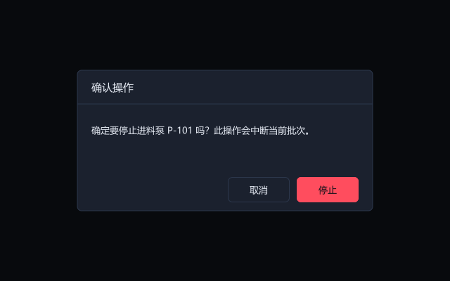
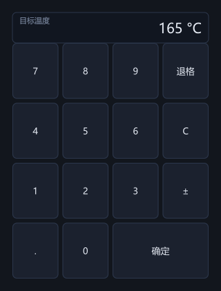
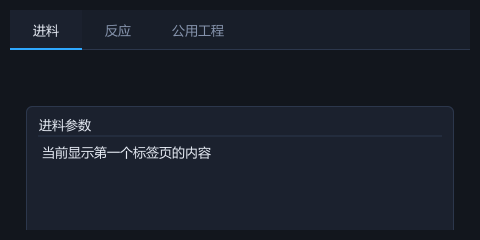
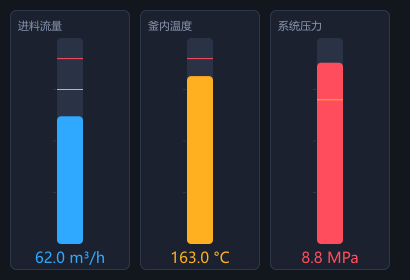
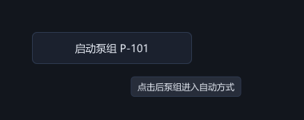

# 新增控件（应用外壳 + 触摸屏输入）

这一批补的是"应用外壳"和"触摸屏输入"两类——底层显示控件（表格、仪表、趋势、三维）本来就强，缺的是做真实应用绕不开的对话框、标签页、右键菜单，以及触摸屏必需的数字键盘。

下面每张图都是代码离屏渲染出来的（`examples/tutorial/widget_shots.cpp`，走的是和真实窗口相同的绘制路径），不是效果图。

---

## Dialog / messageBox / confirmBox — 模态对话框

<p align="center">
  
</p>

一个全窗口遮罩 + 居中面板。它靠**几何**实现模态——面板盖住整个窗口，所以背后的东西点不到——而不是靠一个特殊输入模式。

```cpp
#include "geeyoou/widget/Dialog.hpp"

// 一句话确认框，危险操作用红色
confirmBox(win, "确认操作",
           "确定要停止进料泵 P-101 吗？此操作会中断当前批次。",
           [&] { stopPump(); },        // 只有点“停止”才执行
           "停止", "取消", /*danger=*/true);

// 或消息框
messageBox(win, "提示", "配方已下发。", {"知道了"});
```

> **生命周期**：按钮点击时它的 `clicked` 信号正在发射，若此时销毁对话框就是销毁"正在发射的信号的宿主"——契约 D7 禁止。所以 `close()` 把关闭推迟到一个**自停止的零延时定时器**里执行，等发射退栈后才拆。`test_dialog.cpp` 在 ASan 下守着这条。

## NumericKeypad / numericInput — 触摸屏数字键盘

<p align="center">
  
</p>

工控 HMI 常是触摸屏、没有物理键盘，改一个设定值必须弹屏上键盘。这不是锦上添花，是"能不能用"。

```cpp
#include "geeyoou/widget/NumericKeypad.hpp"

// 点一个设定值字段，弹出键盘，确定后写回
numericInput(win, "目标温度", currentTemp,
             [&](double v) { setpoint = v; }, "°C");
```

## TabView — 标签页

<p align="center">
  
</p>

参数配置页几乎必用。隐藏的页因为 `animationTickTree` 跳过不可见子树，会自动停掉周期性工作。

```cpp
#include "geeyoou/widget/TabView.hpp"

auto* tv = content->add<TabView>();
Widget* feed = tv->addTab("进料");     // 返回空白页，自己往里塞控件
Widget* rxn  = tv->addTab("反应");
tv->currentChanged.connect([](int i){ /* 切页 */ });
```

## Bargraph — 液位棒图

<p align="center">
  
</p>

罐区液位、填充百分比这类"看满没满"的值，棒图比弧形仪表直观。和 `Gauge` 共用 range/value/band API，两者互换是一行改动。**填充色由值所在区间自动决定**——上图温度过预警线转橙、压力过报警线转红，一行 `if` 都不用写。

```cpp
#include "geeyoou/hmi/Bargraph.hpp"

auto* b = content->add<Bargraph>();
b->setRange(0, 100);
b->setBands(75, 90);      // 预警 75、报警 90
b->setTitle("进料流量");
b->setUnit("m³/h");
b->setValue(62);
```

## ContextMenu — 右键上下文菜单

（无独立配图；它复用 `MenuButton` 的菜单外观，在光标处弹出。）

表格行、趋势点、设备符号上右键出操作菜单。持有一个 `ContextMenu` 成员，右键时 `popupAt`：

```cpp
#include "geeyoou/widget/ContextMenu.hpp"

// 作为拥有右键的控件的成员
ContextMenu menu_;

// 初始化时
menu_.setItems({{"确认报警", "ack"}, {"屏蔽", "shelve"},
                MenuItem::sep(), {"查看历史", "history"}});
menu_.triggered.connect([](const std::string& id){ /* 分发 */ });

// 在 onMouse 里，看到右键时
if (e.button == MouseButton::Right && e.action == MouseAction::Press) {
  menu_.popupAt(window(), e.windowPos);
}
```

> 生命周期同 `MenuButton`：菜单是 Window 的子节点、比本对象长命，用 `ConnectionScope`（声明在末、最先析构）在本对象析构前切断订阅。

## Tooltip — 悬浮提示

<p align="center">
  
</p>

把指针停在控件上，约 0.6 秒后浮出一个气泡说明。它不是一个控件，而是 `Window` 亲手画在最上层的一块气泡——所以它**不吃输入、不需要关闭逻辑**，鼠标一移走就消失。设一句话即可，容器上设的提示对整块区域生效，除非下面的子控件设了自己的：

```cpp
// 任意 Widget 都能设，设空串即清除
btn->setTooltip("点击后泵组进入自动方式");
bar->setTooltip("绿 → 黄 → 红：越过预警 / 报警阈值即变色");
```

> **零字节代价**：`Widget` 是全库实例化最多的类型，`Widget.cpp` 里有一条 16 字节的体积预算断言死死守着它——`layout_` 和 `naturalSize_` 已把预算用满。可几乎没有控件真会设提示，若给基类加个成员（哪怕一个指针）就是让所有不设提示的控件替它买单。所以提示文字存在一张**以 `this` 为键的旁路表**里（`Widget.cpp`），不设提示的控件一个字节都不花；`~Widget` 负责擦掉自己的条目，`test_tooltip.cpp` 在 ASan 下守着"析构后地址复用不会串味"。
>
> **生命周期**：停顿计时器捕获了 `Window`，窗口若在气泡弹出前就关掉，`~Window` 必须停掉它，否则几百毫秒后回调会打进已释放的窗口——和动画时钟同一个坑，同一个测试形状。

---

## 每个都过了三道门

不只是"能编译"：每个控件都通过 **door-coverage lint**（新增的每一处"调虚函数后碰成员"的帧都登记进 `docs/iterations/02-layout-engine.md` §11.4，或改成尾发射）、**ASan 门禁**（Dialog 的延迟关闭生命周期有专门 ASan 测试）、**Debug 断言**，以及各自的单元测试。

## 还没做（诚实交代）

- **2D 组态图元（管线/罐/动画流向）**：范围大，单独成轮。
- **趋势历史回放**：要在既有 `TrendChart` 上加历史滚动/游标/缩放，改动面大，单独成轮。
- **faceplate（设备面板）**：本质是"装了设备控件的 `Dialog`"，地基已就位，可直接用 `Dialog` + 控件拼出，无需新类。
